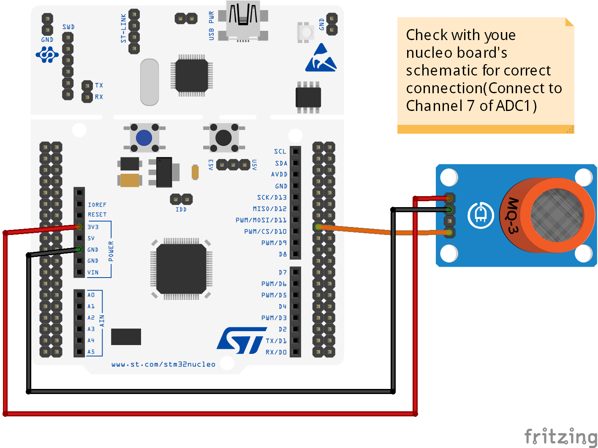

# Hand Sanitizer Alcohol Detector

Masks, Hand Sanitizers have become a routine of our lives since the pandemic begun. Few exploit this situation and try to sell us fake products. Such fake hand sanitizers are useless since there might be little to no alcohol content in it. This gave rise to this project based on STM32 Nucleo-H7A3ZI development board and a MQ-3 Alcohol sensor.

## Schematic

*Schematic of the project*
**NOTE:** This schematic is for refrence only. Connect the Analog out of MQ-3 Sensor to ADC1 Channel 7 of your board. Also change the on-board LED port and pin number accordingly in main.c file line 56 and 58.

## Working

Whenever there is presence of alcohol near the sensor the on-board led lights up (Your need to configure according to your board), since alcohol vaporizes it is good to have the sensor near neck of sanitizer dispenser.
